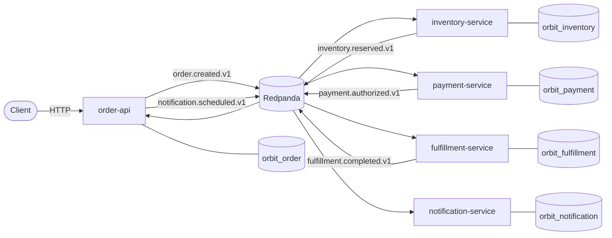

# Orbit

Orbit is an event-driven backend that processes an order workflow across
independent services without relying on a distributed database transaction. It
demonstrates the mechanisms that make event-driven systems reliable in practice:
the transactional outbox, idempotent consumers, saga compensation, bounded
retries, dead-letter handling, versioned event contracts, and end-to-end
observability.

The workflow is coordinated with **choreography**: each service reacts to an
event and emits the next one. The Order service owns the order aggregate and
reflects the workflow state; it never reaches into another service's data.

## Services

| Service | Owns | Produces | Consumes |
| --- | --- | --- | --- |
| `order-api` | orders, timeline, idempotency keys | `order.created.v1`, `order.completed.v1`, `order.cancelled.v1`, `notification.scheduled.v1` | `inventory.*`, `payment.*`, `fulfillment.*` |
| `inventory-service` | stock, reservations | `inventory.reserved.v1`, `inventory.rejected.v1`, `inventory.released.v1` | `order.created.v1`, `payment.failed.v1`, `fulfillment.failed.v1` |
| `payment-service` | payments | `payment.authorized.v1`, `payment.failed.v1`, `payment.refunded.v1` | `inventory.reserved.v1`, `fulfillment.failed.v1` |
| `fulfillment-service` | fulfillments | `fulfillment.started.v1`, `fulfillment.completed.v1`, `fulfillment.failed.v1` | `payment.authorized.v1` |
| `notification-service` | notifications | `notification.sent.v1` | `notification.scheduled.v1` |

Each service has its own PostgreSQL database and its own `outbox` and
`processed_messages` tables. Services communicate only through events.

## Architecture



## Requirements

- Docker and Docker Compose
- Go 1.27+ (for running tests and tooling outside containers)

## Quick start

A single command starts the broker, the databases, migrations, seeding, and all
five services:

```sh
docker compose up -d --build
docker compose run --rm seed      # load development inventory
```

The Order API is available at `http://localhost:8080`. Create an order:

```sh
curl -sS -X POST http://localhost:8080/v1/orders \
  -H 'Content-Type: application/json' \
  -H 'Idempotency-Key: demo-1' \
  -d '{
        "customer_id": "customer-1",
        "currency": "USD",
        "items": [{"sku": "SKU-WIDGET", "quantity": 2, "unit_price_cents": 1500}]
      }'
```

Inspect the distributed timeline a few seconds later:

```sh
curl -sS http://localhost:8080/v1/orders/<order-id>/timeline
```

`make smoke` performs both steps and prints the timeline. To include Jaeger,
Prometheus, and Grafana:

```sh
docker compose -f docker-compose.yml -f deploy/docker-compose.observability.yml up -d --build
# Jaeger UI      http://localhost:16686
# Prometheus     http://localhost:9090
# Grafana        http://localhost:3000
```

## HTTP API

| Method | Path | Description |
| --- | --- | --- |
| `POST` | `/v1/orders` | Create an order. Supports the `Idempotency-Key` header. |
| `GET` | `/v1/orders/{id}` | Retrieve an order. |
| `GET` | `/v1/orders` | List orders with `status`, `customer_id`, `limit`, `cursor`, `sort`. |
| `GET` | `/v1/orders/{id}/timeline` | Inspect the order's distributed timeline. |
| `GET` | `/healthz`, `/readyz` | Liveness and readiness. |
| `GET` | `/metrics` | Prometheus metrics. |

Every response carries `X-Request-ID` and `X-Correlation-ID`. Errors use one
shape:

```json
{
  "error": {
    "code": "invalid_argument",
    "message": "at least one item is required",
    "request_id": "9c1c...",
    "details": {}
  }
}
```

The full contract is in [`docs/openapi.yaml`](docs/openapi.yaml).

## Failure injection

Development deployments can inject failures per order (only when
`ORBIT_ENABLE_FAULT_INJECTION=true`). Add a `faults` object to the create-order
body:

| Fault | Effect |
| --- | --- |
| `inventory_reject` | Inventory emits `inventory.rejected.v1`; the order is cancelled. |
| `payment_reject` | Payment emits `payment.failed.v1`; inventory is released. |
| `payment_timeout` | Payment handler fails transiently, is retried, then dead-lettered. |
| `fulfillment_fail` | Fulfillment fails; payment is refunded and inventory released. |
| `notification_fail` | Notification fails permanently and is dead-lettered. |

Example:

```sh
curl -sS -X POST http://localhost:8080/v1/orders \
  -H 'Content-Type: application/json' \
  -d '{
        "customer_id": "customer-1",
        "currency": "USD",
        "items": [{"sku": "SKU-WIDGET", "quantity": 1, "unit_price_cents": 1500}],
        "faults": {"fulfillment_fail": "true"}
      }'
```

## Configuration

All configuration is environment driven; see [`.env.example`](.env.example).
The most important variables:

| Variable | Default | Purpose |
| --- | --- | --- |
| `ORBIT_DATABASE_URL` | required | Service database URL. |
| `ORBIT_KAFKA_BROKERS` | `localhost:9092` | Comma-separated broker list. |
| `ORBIT_KAFKA_TOPIC_PREFIX` | `orbit` | Topic prefix; topics are `<prefix>.<family>.events`. |
| `ORBIT_ENABLE_FAULT_INJECTION` | `false` | Enables per-order fault hints. |
| `ORBIT_OTLP_ENDPOINT` | empty | OTLP gRPC endpoint; empty disables trace export. |
| `ORBIT_OUTBOX_POLL_INTERVAL` | `500ms` | Outbox publisher poll interval. |
| `ORBIT_CONSUMER_MAX_RETRIES` | `5` | In-process retries before dead-lettering. |
| `ORBIT_CONSUMER_RETRY_BACKOFF` | `250ms` | Base retry backoff (exponential). |

## Development

```sh
make build          # compile everything
make test           # unit tests
make test-race      # unit tests with the race detector
make lint           # go vet + gofmt check
make integration    # integration + end-to-end tests (needs the compose stack)
make up             # start the local stack
make down           # stop the stack and delete volumes
```

Integration tests are guarded by the `integration` build tag and the
`ORBIT_TEST_INTEGRATION=1` environment variable. They create isolated databases
and a unique topic prefix per run, then exercise the full workflow against real
PostgreSQL and Redpanda.

## Operator CLI

`orbitctl` (the `orbitctl` compose service) runs migrations, seeds data, and
inspects or replays dead letters:

```sh
docker compose run --rm orbitctl migrate --service order --direction up
docker compose run --rm seed
docker compose run --rm orbitctl dlq list   --topic orbit.payment.events.dlq
docker compose run --rm orbitctl dlq replay --topic orbit.payment.events.dlq
```

## Repository layout

```
cmd/                     service entrypoints and orbitctl
internal/events/         event envelope, payload contracts, registry
internal/outbox/         transactional outbox store and publisher
internal/consumer/       idempotency, retries, dead-lettering
internal/idempotency/    processed-message tracking
internal/order/          order aggregate, API, saga reactions, migrations
internal/inventory/      inventory service
internal/payment/        payment service
internal/fulfillment/    fulfillment service
internal/notification/   notification service
internal/platform/       config, logging, telemetry, metrics, http, broker
test/                    integration harness and end-to-end tests
docs/                    architecture, contracts, reliability, ADRs
deploy/                  compose overlay and observability configuration
```

## Documentation

- [`docs/architecture.md`](docs/architecture.md) — system design and data model
- [`docs/event-contracts.md`](docs/event-contracts.md) — event catalogue and schema evolution
- [`docs/reliability.md`](docs/reliability.md) — outbox, idempotency, retries, DLQ
- [`docs/saga.md`](docs/saga.md) — choreography and compensation
- [`docs/observability.md`](docs/observability.md) — logs, metrics, traces, timeline
- [`docs/failure-recovery.md`](docs/failure-recovery.md) — failure modes and recovery
- [`docs/security.md`](docs/security.md) — threat model and security considerations
- [`docs/openapi.yaml`](docs/openapi.yaml) — OpenAPI contract for the Order API
- [`docs/adr/`](docs/adr/) — architecture decision records

## Security considerations

- Services expose only the HTTP API; internal databases and the broker are not
  published beyond the compose network except for local development ports.
- Inputs are strictly decoded (unknown fields rejected) and bounded in size.
- Fault injection is disabled unless explicitly enabled and is intended for
  development; it is rejected by the API when disabled.
- No secrets are committed; configuration is supplied through the environment.
- `orbitctl` and the services use the least-privileged database user supplied
  through `ORBIT_DATABASE_URL`.
