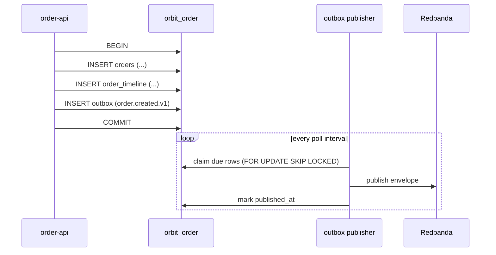

# Architecture

## Context

Orbit processes an order through several independent services. A single order
touches inventory, payment, fulfillment, and notification. The system must make
progress without a distributed transaction, tolerate duplicate and delayed
messages, and remain inspectable while a workflow is in flight.

The design uses an event log (Kafka-compatible; Redpanda locally) as the
integration backbone and the transactional outbox pattern to guarantee that
domain state and the events describing it are never written inconsistently.

## Guiding constraints

- **No shared database.** Each service owns its schema and never reads another
  service's tables. Integration is through events only.
- **At-least-once delivery.** The broker and the outbox both guarantee
  at-least-once, never exactly-once. Every consumer is idempotent.
- **Ordering per aggregate.** Events are keyed by aggregate ID (the order ID),
  so all events for one order land on one partition in a stable order.
- **Boring technology.** Go, PostgreSQL, and a Kafka-compatible broker.

## Service boundaries

| Service | Responsibility | Owns (tables) |
| --- | --- | --- |
| Order | Order aggregate, workflow state, timeline, idempotent creation | `orders`, `order_timeline`, `idempotency_keys` |
| Inventory | Stock levels and reservations | `inventory_items`, `reservations` |
| Payment | Authorization and refunds | `payments` |
| Fulfillment | Fulfillment lifecycle | `fulfillments` |
| Notification | Customer notifications | `notifications` |

Every service database also contains the platform tables `outbox` and
`processed_messages`.

The Order service is the only service that exposes an HTTP API. The other
services expose `/healthz`, `/readyz`, and `/metrics` only.

## Data model

### Order (`orbit_order`)

- `orders` — one row per order: customer, items (JSONB), total, currency,
  status, cancellation reason/stage, compensation progress flags, fault hints,
  correlation ID.
- `order_timeline` — append-only log of the events the Order service observed,
  unique on `(order_id, event_id)`. This is the distributed timeline exposed at
  `GET /v1/orders/{id}/timeline`.
- `idempotency_keys` — request hash and stored response for idempotent order
  creation.

### Inventory (`orbit_inventory`)

- `inventory_items` — stock per SKU with `CHECK (available >= 0)` and
  `CHECK (reserved >= 0)`.
- `reservations` — one row per order, unique on `order_id`, with status
  `reserved`/`released`.

### Payment, Fulfillment, Notification

Single-table services keyed uniquely by `order_id` (notification keyed by
`(order_id, topic)`), which makes retries idempotent at the storage layer as
well as at the message layer.

### Platform tables

- `outbox` — pending events with `seq` (publication order), `attempts`,
  `available_at`, `last_error`, and `published_at`.
- `processed_messages` — `(consumer, event_id)` primary key; the marker that
  makes a consumer idempotent.

## Write path and the transactional outbox

A domain change and its event are written in one database transaction:



The outbox row contains the full encoded envelope. The publisher claims a batch
by leasing rows (`available_at`), releases the row lock, publishes, and then
marks the row published. If the process crashes between publish and mark, the
record is republished later — this is the at-least-once window described in
[`reliability.md`](reliability.md).

## Messaging

Topics are derived from the event family (the substring before the first dot):

```
<prefix>.order.events
<prefix>.inventory.events
<prefix>.payment.events
<prefix>.fulfillment.events
<prefix>.notification.events
<prefix>.<family>.events.dlq
```

Events are produced with `acks=all` and hashed by aggregate ID. A consumer
commits its offset only after the handler (or the dead-letter publish) succeeds.

## Coordination

Orbit uses **choreography**, not a central orchestrator. Each service decides
when to act by reacting to an event; see [`saga.md`](saga.md) for the rationale
and the compensation rules. The Order service is a participant that also happens
to expose the read API; it is not a controller that issues commands.

## Consistency

- **Local transactions** give atomicity within a service.
- **The outbox** gives atomicity between a service's state and its emitted
  events.
- **Idempotent consumers** give effective-once processing under at-least-once
  delivery.
- The overall system is **eventually consistent**: an order reaches a terminal
  state after a bounded number of event hops, and intermediate states are
  visible in the timeline.

## Extension points

- Add a service by owning a new schema, subscribing to the relevant stream, and
  emitting a new versioned event.
- Add an event by registering it in `internal/events/registry.go` and adding a
  golden fixture to the contract test.
- Replace the in-process handlers with long-running jobs by moving side effects
  behind the same `consumer.Handler` interface.

## Trade-offs

- **Choreography over orchestration** keeps services decoupled but makes the
  global flow implicit; the timeline endpoint and event contracts make it
  observable. See ADR-0001.
- **At-least-once over exactly-once** avoids distributed-transaction
  complexity at the cost of requiring idempotency everywhere. See ADR-0003.
- **A database per service** improves isolation at the cost of operational
  overhead; locally these are separate databases on one PostgreSQL instance.
- **One topic per family** keeps the topology small; consumers ignore event
  types they do not care about.
