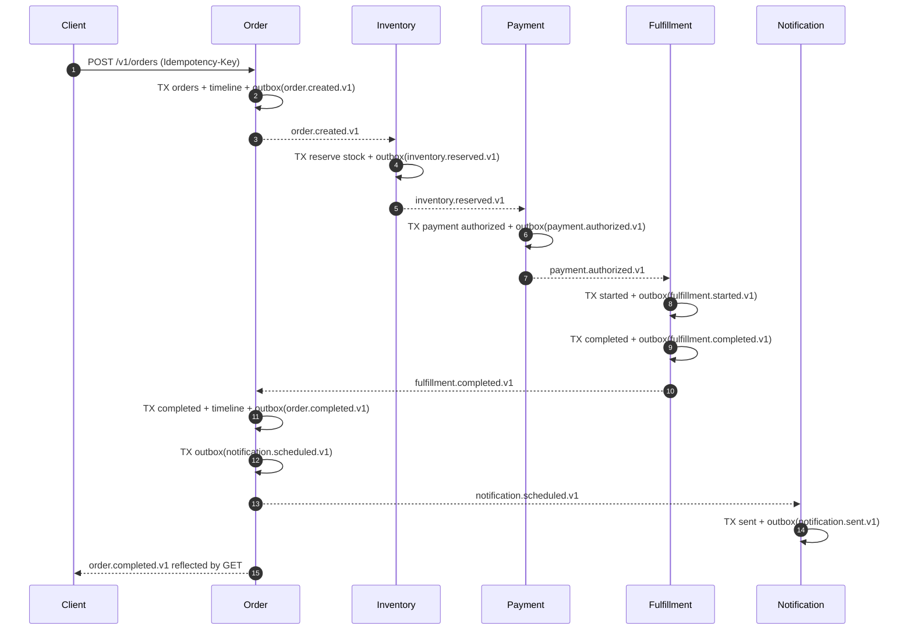
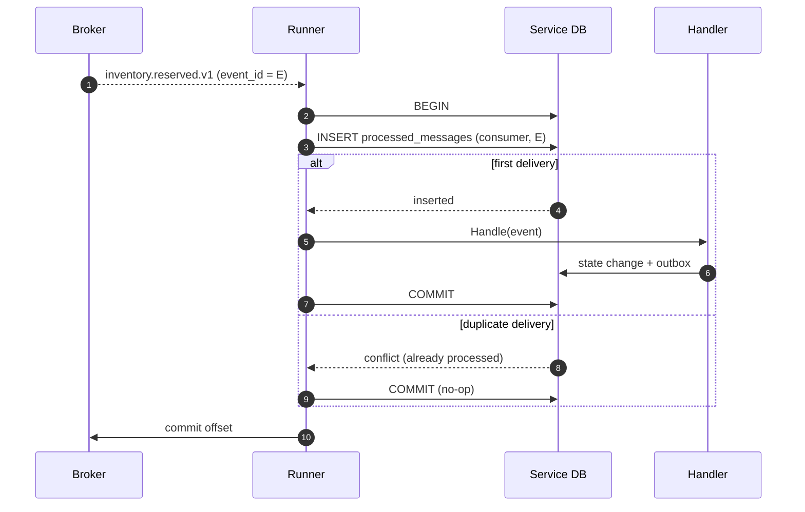

# Saga and workflow coordination

## Choreography, not orchestration

Orbit uses **choreography**: each service reacts to an event and emits the next
one. There is no central orchestrator issuing commands.

This choice is deliberate. The order workflow spans five services that already
publish and consume events, so an orchestrator would duplicate the routing that
the event log already provides and would become a coordination hotspot. With
choreography, adding a participant means subscribing to an existing stream; no
central component changes. The cost is that the global flow is implicit — it is
made explicit by the event contracts and the order timeline.

The Order service is a *participant*, not a controller. It owns the order
aggregate and advances it as it observes events; it does not drive the other
services.

## Order state machine

```
                 inventory.rejected
   pending ─────────────────────────────► cancelled
      │
      │ inventory.reserved
      ▼
 inventory_reserved ──payment.failed──► cancelling ──inventory.released──► cancelled
      │
      │ payment.authorized
      ▼
 payment_authorized
      │
      │ fulfillment.started
      ▼
 fulfillment_started ──fulfillment.failed──► cancelling
      │                                         ▲
      │ fulfillment.completed                    │ payment.refunded
      ▼                                         │ inventory.released
  completed                                     └──────────────► cancelled
```

Terminal states are `completed` and `cancelled`. Transitions are guarded so that
duplicate or out-of-order events are no-ops (see below).

## Successful order



## Payment failure with compensation

Payment failure is compensated by releasing the inventory reservation. Because
the payment failed (it was never authorized), no refund is required.

```mermaid
sequenceDiagram
    autonumber
    participant I as Inventory
    participant P as Payment
    participant O as Order

    I-->>P: inventory.reserved.v1
    P->>P: payment.failed.v1 (permanent)
    P-->>I: payment.failed.v1
    P-->>O: payment.failed.v1
    Note over O: order → cancelling (stage=payment)
    I->>I: TX release reservation + outbox(inventory.released.v1)
    I-->>O: inventory.released.v1
    Note over O: inventory_released=true; requirements met
    O->>O: TX cancelled + outbox(order.cancelled.v1)
```

If fulfillment fails instead, payment *was* authorized, so cancellation requires
a refund **and** a release. The Order service tracks both flags and only cancels
once both compensations are observed; whichever arrives last completes the
cancellation.

## Duplicate-event handling

Redelivery is expected. The processed-message marker is written in the same
transaction as the state change, so a duplicate is acknowledged without invoking
the handler again. Even if the marker is bypassed, the domain transitions and
unique constraints are idempotent.



Because the marker and the state change commit atomically, a crash mid-handler
rolls both back; the event is redelivered and processed exactly once from the
domain's perspective.

## Compensation rules

| Trigger | Compensating action | Publishes | Completed when |
| --- | --- | --- | --- |
| `inventory.rejected.v1` | none (nothing reserved) | `order.cancelled.v1` | immediately |
| `payment.failed.v1` | release inventory | `inventory.released.v1` | release observed |
| `fulfillment.failed.v1` | refund payment + release inventory | `payment.refunded.v1`, `inventory.released.v1` | both observed |

## Why choreography is viable here

- Every step has a clear triggering event and a clear outcome event.
- Compensation is local to the service that owns the resource being
  compensated: Inventory owns releases, Payment owns refunds.
- The Order service records completion conditions and remains the single source
  of truth for workflow status.

For a workflow with many conditional branches, a central orchestrator with an
explicit state machine would be easier to reason about. The cost of
choreography — an implicit control flow — is mitigated here by a small,
well-documented contract surface and the timeline read model.
